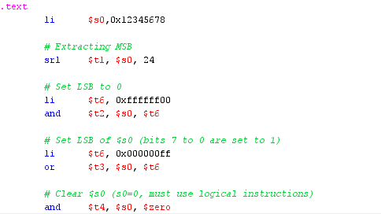

## WEEK 4
### * Assignment 1: 
Write a program to do the following tasks: 
* Extract MSB of $s0  
* Clear LSB of $s0 
* Set LSB of $s0 (bits 7 to 0 are set to 1) 
* Clear $s0 (s0=0, must use logical instructions) 

MSB: *Most Significant Byte*
LSB: *Least Significant Byte*

