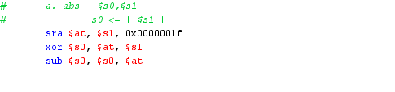
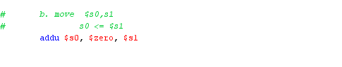
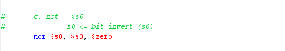
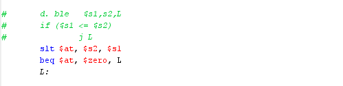
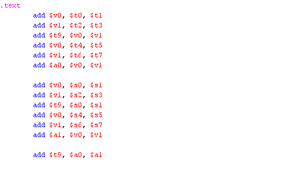
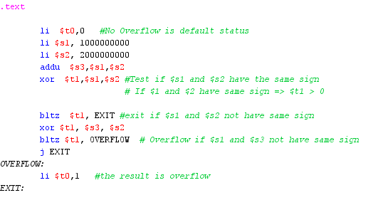
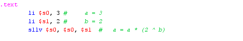

## WEEK 4
### * Assignment 1: 
Write a program to do the following tasks: 
* Extract MSB of $s0  
* Clear LSB of $s0 
* Set LSB of $s0 (bits 7 to 0 are set to 1) 
* Clear $s0 (s0=0, must use logical instructions) 
MSB: *Most Significant Byte*

LSB: *Least Significant Byte*


### * Assignment 2: 
 Pseudo instructions in MIPS are not-directly-run-on-MIPS-processor instructions which need to be converted to real-instructions of MIPS. Re-write the following pseudo instructions using real-instructions understood by MIPS processors: 

a. abs   $s0,s1  
	s0 <= | $s1 | 



b. move  $s0,s1  
	s0 <= $s1 



c. not   $s0  
	s0 <= bit invert (s0) 



d. ble   $s1,s2,L 
 	if (s1 <= $s2)  
	jL



### * Assignment 3:
Write the shortest possible program to add the contents of the 8 registers $s0-s7 and $t0-t7, storing the result in t9. The original contents of the 16 registers should not be modified



### * Assignment 4:

 To dectect overflow in additional operation, we also use other rule than the one in Assignment 1. This rule is: when add two operands that have the same sign, overflow will occur if the sum doesn’t have the same sign with either operands. You need to use this rule to write another overflow detection program.



### * Assignment 5:
Write a program that implement multiply by a small power of 2. (2, 4, 8, 16, etc for example)



### Conclusions: 
Before you pass the laboratory exercise, think about the questions below: 

+ What is the difference between SLLV and SLL instructions?

```
sll $t1, $t2, 10
sllv $t1, $t2, $t3

```

SLL dịch bít của thanh ghi $t2 sang trái n bit, với n là hằng số (ví dụ trên là 10),

SLLV dịch bít của thanh ghi $t2 sang trái n bit, với n là giớ trị lưu tại $t3. 

+ What is the difference between SRLV and SRL instructions?

```
srl $t1, $t2, 10
srlv $t1, $t2, $t3
```

SRL dịch bít của thanh ghi $t2  sang phải n bit, với n là hằng số (ví dụ trên là 10),

SRLV dịch bít của thanh $t2 ghi sang phải n bit, với n là giớ trị lưu tại $t3.
